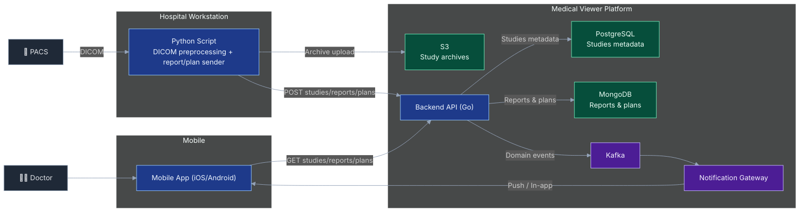

# Medical DICOM Viewer Platform — Product Overview

Платформа для быстрой доставки медицинских DICOM-исследований врачу на мобильное устройство с мгновенным открытием уже загруженных данных и поддержкой клинической отчетности.

## 1. Задача, которую решает продукт

В клинической практике врачам нужно:
- быстро получать исследования из PACS на мобильное устройство;
- открывать снимки без долгого ожидания;
- видеть актуальные отчеты дежурств и планы операций.

## 2. Ценность для клиники и бизнеса

- Ускорение принятия клинических решений за счет мгновенного доступа к данным.
- Единый цифровой контур для исследований, отчетов и планов операций.

## 3. Как работает продукт

### Исследования

1. Скрипт на больничном ПК получает исследование из PACS.
2. Выполняет полный DICOM-парсинг и предрасчеты для просмотра.
3. Формирует архив и публикует метаданные в backend.
4. Backend отправляет событие через брокер и Notification Gateway.
5. Мобильное приложение получает уведомление, запрашивает short-lived signed URL у backend, загружает и открывает исследование.

### Отчеты и планы операций

1. Скрипт отправляет отчеты дежурств и планы операций в backend API.
2. Backend сохраняет документы в MongoDB.
3. Мобильное приложение получает уведомление и запрашивает актуальные данные через backend.

## Архитектура

### Компоненты

- **Hospital Script (Python)**
  - интеграция с PACS;
  - DICOM parsing + предрасчеты;
  - архивирование и загрузка в S3;
  - отправка отчетов/планов на backend API.

- **Backend (Go)**
  - API для исследований, отчетов, планов и настроек пользователей;
  - хранение метаданных исследований в PostgreSQL;
  - хранение отчетов и планов операций в MongoDB;
  - выдача short-lived signed URL для безопасного скачивания архивов из S3;
  - публикация событий в Kafka.

- **Notification Gateway**
  - потребление Kafka событий;
  - фильтрация и маршрутизация по пользователю;
  - доставка на мобильные устройства (FCM/APNS/in-app).

- **Mobile App (Android/iOS)**
  - получение событий и обновление листингов;
  - авто- или ручная загрузка архива;
  - распаковка, pre-render и быстрый локальный просмотр.

## 4. Единая C4-схема приложения (Mermaid)

## 5. Observability и SLO

- `OpenTelemetry` используется в `script`, `backend` и `notification gateway` с единым `trace_id`.
- Основной end-to-end трейс для исследования: `pacs_fetch -> preprocess -> s3_upload -> backend_ingest -> kafka_publish -> notify -> mobile_download -> mobile_open`.
- Бизнес-SLI:
  - `time_to_available_study`;
  - `time_to_available_report`;
  - `time_to_available_surg_plan`;
  - `% успешной доставки уведомлений`;
  - `% успешных загрузок исследований`.
- Технические SLO (целевые):
  - `time_to_available_study < 5 мин`;
  - `time_to_available_report < 2 мин`;
  - `time_to_available_surg_plan < 2 мин`;
  - `notification delivery success > 99%`;
  - `download success > 97%`.

## 6. Основные API endpoint'ы

- `POST /api/v1/studies` — прием метаданных исследования от скрипта.
- `GET /api/v1/studies` — список исследований для мобильного приложения.
- `GET /api/v1/studies/{id}` — детали исследования.
- `GET /api/v1/studies/{id}/download-link` — выдача short-lived signed `download_url`.
- `GET /api/v1/studies/{id}/download` — совместимый endpoint (redirect на signed S3 URL).
- `DELETE /api/v1/studies/{id}` — удаление исследования.
- `POST /api/v1/reports` — загрузка отчета дежурства.
- `GET /api/v1/reports` — список отчетов.
- `POST /api/v1/plans` — загрузка плана операций.
- `GET /api/v1/plans/current` — текущий план операций.
- `GET /api/v1/user/settings` / `PUT /api/v1/user/settings` — настройки пользователя.
